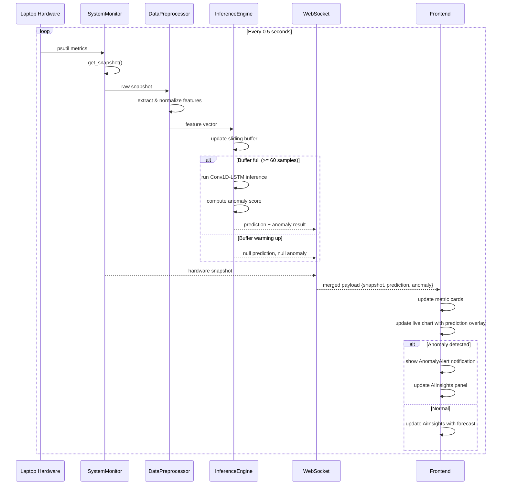

# Architecture Plan: Real-Time Anomaly Detection & Time Forecasting with Conv1D-LSTM

## 1. Current Codebase Analysis

### Backend (Python/FastAPI)
- **`backend/app/monitor.py`** — Collects real-time hardware metrics via `psutil` (CPU, RAM, Disk, Network, Battery, Processes)
- **`backend/app/main.py`** — FastAPI server with WebSocket endpoint (`/ws`) pushing snapshots every 0.5s
- **`backend/app/schemas.py`** — Pydantic models for all hardware data
- **`backend/ai/agent.py`** — Placeholder rule-based "AI" agent (no ML model yet)
- **`backend/ai/__init__.py`** — Exports `SystemAiAgent`

### Frontend (React/TypeScript/Vite)
- **`frontend/src/App.tsx`** — WebSocket client, maintains 30-point sliding history
- **`frontend/src/components/Dashboard.tsx`** — Main dashboard layout
- **`frontend/src/components/LiveChart.tsx`** — Recharts area chart for historical metrics
- **`frontend/src/components/MetricCard.tsx`** — Individual metric display cards
- **`frontend/src/components/AiInsights.tsx`** — Manual "Analyze" button with rule-based heuristics
- **`frontend/src/components/ProcessTable.tsx`** — Top processes table

### Key Issues Identified
1. **No ML model integration** — `agent.py` is purely rule-based
2. **No data preprocessing pipeline** — Raw metrics are sent directly without normalization/sequencing
3. **Frontend requires manual interaction** — AI Insights panel needs user to click "Analyze"
4. **No real-time prediction streaming** — Predictions are not pushed alongside metrics
5. **History window is only 30 points (15s)** — Too short for meaningful time-series forecasting

---

## 2. Proposed Architecture

### High-Level Data Flow

```
┌─────────────────────────────────────────────────────────────────────┐
│                        LAPTOP HARDWARE                              │
│  CPU / RAM / Disk / Network / Battery / Processes                   │
└────────────────────────┬────────────────────────────────────────────┘
                         │ psutil (every 0.5s)
                         ▼
┌─────────────────────────────────────────────────────────────────────┐
│                    BACKEND (FastAPI)                                 │
│                                                                     │
│  ┌──────────────┐    ┌──────────────────┐    ┌───────────────────┐  │
│  │ SystemMonitor │───▶│ DataPreprocessor │───▶│  InferenceEngine  │  │
│  │ (monitor.py)  │    │ (preprocess.py)  │    │  (inference.py)   │  │
│  └──────────────┘    └──────────────────┘    └────────┬──────────┘  │
│                                                        │            │
│  ┌─────────────────────────────────────────────────────┘            │
│  │  WebSocket Merge: { snapshot + prediction + anomaly }            │
│  ▼                                                                  │
│  ┌──────────────────────────────────────────────────────────────┐   │
│  │  /ws  (WebSocket endpoint - streams every 0.5s)              │   │
│  └──────────────────────────────────────────────────────────────┘   │
└────────────────────────┬────────────────────────────────────────────┘
                         │ WebSocket
                         ▼
┌─────────────────────────────────────────────────────────────────────┐
│                    FRONTEND (React + Vite)                           │
│                                                                     │
│  ┌──────────────────────────────────────────────────────────────┐   │
│  │  App.tsx  (WebSocket client - receives merged payload)       │   │
│  └──────────┬───────────────────────────────────────────────────┘   │
│             │                                                       │
│  ┌──────────▼──────────┐  ┌──────────────────┐  ┌───────────────┐  │
│  │  Dashboard.tsx      │  │  LiveChart.tsx    │  │  AnomalyAlert │  │
│  │  (metrics display)  │  │  (prediction line)│  │  (new)        │  │
│  └─────────────────────┘  └──────────────────┘  └───────────────┘  │
│                                                                     │
│  ┌──────────────────────────────────────────────────────────────┐   │
│  │  AiInsights.tsx  (REWRITTEN - auto-updates with predictions) │   │
│  └──────────────────────────────────────────────────────────────┘   │
└─────────────────────────────────────────────────────────────────────┘
```

---

## 3. Detailed Implementation Steps

### Step 1: Create Data Preprocessing Pipeline

**New file: `backend/ai/preprocess.py`**

Purpose: Transform raw hardware metrics into normalized sequences suitable for Conv1D-LSTM input.

#### Input Features (selected from `HardwareSnapshot`):
| Feature | Source | Description |
|---------|--------|-------------|
| `cpu_usage` | `cpu.overall_usage` | Overall CPU utilization % |
| `cpu_temp` | `cpu.temperature` | CPU temperature °C |
| `cpu_power` | `cpu.power_draw` | Estimated power draw W |
| `cpu_freq` | `cpu.frequency_mhz` | Current CPU frequency MHz |
| `mem_percent` | `memory.virtual.percent` | RAM usage % |
| `mem_used` | `memory.virtual.used` | RAM used bytes |
| `disk_read` | `disk.read_speed_bps` | Disk read speed B/s |
| `disk_write` | `disk.write_speed_bps` | Disk write speed B/s |
| `net_up` | `network.upload_speed_bps` | Network upload B/s |
| `net_down` | `network.download_speed_bps` | Network download B/s |

#### Preprocessing Steps:
1. **Sliding Window Buffer** — Maintain a circular buffer of the last N snapshots (e.g., N=60 = 30s of data at 0.5s intervals)
2. **Normalization** — Min-max scaling per feature using running min/max statistics (or fixed ranges based on typical laptop specs)
3. **Sequence Formation** — For each inference tick, form a tensor of shape `(1, sequence_length, num_features)` where:
   - `sequence_length` = 60 (30 seconds of history)
   - `num_features` = 10 (the features above)
4. **NaN/Inf Handling** — Clamp and fill missing values

#### Key Design Decisions:
- Use **online normalization** (running mean/std) rather than fitting on a static dataset, since the system runs continuously
- Buffer is stored in-memory in the `InferenceEngine` class
- First N seconds after startup will have insufficient data — return "warming up" status

---

### Step 2: Create Model Loader & Inference Engine

**New file: `backend/ai/model_loader.py`**
**New file: `backend/ai/inference.py`**

#### Model Architecture (Conv1D-LSTM):
```
Input: (batch, 60, 10)  ← 60 timesteps, 10 features
    │
    ▼
Conv1D(filters=64, kernel_size=3, activation='relu')
    │
    ▼
MaxPooling1D(pool_size=2)
    │
    ▼
Conv1D(filters=128, kernel_size=3, activation='relu')
    │
    ▼
MaxPooling1D(pool_size=2)
    │
    ▼
LSTM(units=100, return_sequences=True)
    │
    ▼
LSTM(units=50, return_sequences=False)
    │
    ▼
Dropout(0.2)
    │
    ▼
Dense(25, activation='relu')
    │
    ▼
Dense(10, activation='linear')  ← Predict next timestep's 10 features
```

#### Dual Output Heads (for separate tasks):
1. **Time Forecasting Head** — Predicts the next N steps (e.g., next 5 timesteps = 2.5s ahead) for all 10 features
2. **Anomaly Detection Head** — Computes reconstruction error (MSE between predicted vs actual). If error > threshold, flag as anomaly

#### Model Loading:
- Load `.h5` file from `backend/ai/models/` directory
- Support for **no-model-available** fallback: if no `.h5` file exists, run in "simulation mode" using statistical anomaly detection (z-score based on rolling mean/std)
- Use `tensorflow.keras.models.load_model()` with lazy loading (load on first inference, not on import)

#### InferenceEngine Class:
```python
class InferenceEngine:
    def __init__(self, sequence_length=60, feature_names=[...]):
        self.buffer = CircularBuffer(maxlen=sequence_length)
        self.model = None  # Lazy loaded
        self.normalizer = OnlineNormalizer()
        self.anomaly_threshold = 0.05  # Configurable MSE threshold

    def load_model(self, model_path: str):
        # Load .h5 file, compile=False

    def preprocess(self, snapshot: HardwareSnapshot) -> np.ndarray:
        # Extract features, normalize, add to buffer

    def predict(self) -> PredictionResult:
        # If buffer not full: return "warming_up"
        # If no model: run statistical fallback
        # Else: run model inference

    def detect_anomaly(self, predicted, actual) -> AnomalyResult:
        # MSE between predicted and actual
        # Flag if exceeds threshold
```

---

### Step 3: Update WebSocket to Stream Predictions + Anomalies

**Modified file: `backend/app/main.py`**

#### New WebSocket Message Format:
```json
{
  "timestamp": 1234567890.0,
  "snapshot": { ... },           // Existing hardware snapshot
  "prediction": {                 // NEW
    "next_5s": [                  // 5 future timesteps
      { "cpu_usage": 45.2, "cpu_temp": 62.1, ... },
      { "cpu_usage": 47.8, "cpu_temp": 63.5, ... },
      ...
    ],
    "forecast_confidence": 0.92
  },
  "anomaly": {                    // NEW
    "is_anomaly": false,
    "anomaly_score": 0.012,
    "anomaly_type": null,         // "cpu_spike", "memory_leak", "thermal_throttle", etc.
    "details": "System operating within normal parameters"
  }
}
```

#### WebSocket Loop Changes:
```python
# In websocket_endpoint:
while True:
    await asyncio.sleep(0.5)
    snapshot = monitor.get_snapshot()

    # Run inference
    prediction = inference_engine.predict(snapshot)
    anomaly = inference_engine.detect_anomaly(prediction, snapshot)

    # Merge and send
    payload = {
        "timestamp": snapshot.timestamp,
        "snapshot": snapshot.model_dump(),
        "prediction": prediction,
        "anomaly": anomaly
    }
    await websocket.send_json(payload)
```

**Performance Consideration:** Inference should complete in <100ms to avoid blocking the 0.5s loop. If model inference is slow, run it in a separate thread using `asyncio.to_thread()` or `run_in_executor()`.

---

### Step 4: Add New Pydantic Schemas for Predictions

**Modified file: `backend/app/schemas.py`**

Add:
```python
class PredictedMetrics(BaseModel):
    cpu_usage: float
    cpu_temp: float
    cpu_power: float
    cpu_freq: float
    mem_percent: float
    mem_used: int
    disk_read: float
    disk_write: float
    net_up: float
    net_down: float

class PredictionResult(BaseModel):
    next_steps: List[PredictedMetrics]  # 5 future steps
    forecast_confidence: float

class AnomalyResult(BaseModel):
    is_anomaly: bool
    anomaly_score: float
    anomaly_type: Optional[str] = None
    details: str

class InferencePayload(BaseModel):
    timestamp: float
    snapshot: HardwareSnapshot
    prediction: Optional[PredictionResult] = None
    anomaly: Optional[AnomalyResult] = None
```

---

### Step 5: Update Frontend for Real-Time Predictions

#### 5a. Update `App.tsx` — Extend WebSocket payload handling

- Parse new `prediction` and `anomaly` fields from WebSocket messages
- Store `prediction` and `anomaly` in state alongside `snapshot`
- Extend `HistoryPoint` to include predicted values for chart overlay

#### 5b. Update `LiveChart.tsx` — Add prediction curve overlay

- Add a dashed "Predicted" line on the chart (e.g., show next 5 predicted points as a dotted extension)
- Use a different color/opacity for predicted vs actual data
- Add a toggle to show/hide prediction overlay

#### 5c. Rewrite `AiInsights.tsx` — Auto-updating AI panel

- Remove the manual "Analyze" button
- Automatically display:
  - **Anomaly Alerts** — Real-time banner when anomaly detected (color-coded: green=normal, yellow=warning, red=critical)
  - **Forecast Summary** — "CPU predicted to reach 78% in next 2.5 seconds"
  - **Confidence Score** — Model confidence indicator
  - **Anomaly History** — Timeline of recent anomalies
- Add a new `AnomalyAlert` component for prominent notifications

#### 5d. New Component: `frontend/src/components/AnomalyAlert.tsx`

- Floating notification bar at top of dashboard
- Slides in when anomaly detected
- Shows: anomaly type, severity, affected metric, timestamp
- Auto-dismisses after 5 seconds or manual close
- Color transitions: green → yellow → red based on anomaly_score

#### 5e. New Component: `frontend/src/components/PredictionGauge.tsx`

- Small gauge widget showing predicted values for next 5-10 seconds
- Can be embedded in MetricCard as a "trend arrow" or mini sparkline

---

### Step 6: Real-Time Optimization (Remove Refresh Dependency)

#### Current Problem:
- Frontend relies on WebSocket push (which IS real-time), but the AI Insights panel requires manual "Analyze" button click
- History window is only 30 points (15 seconds)

#### Solutions:
1. **Increase history window** — Change from 30 to 120 points (60 seconds) for better model context
2. **Auto-stream predictions** — AI Insights panel updates automatically on every WebSocket message (no click needed)
3. **Add prediction trend arrows** — Small up/down arrows next to metric values showing predicted direction
4. **Optimize React re-renders** — Use `React.memo` and `useMemo` for chart components to prevent unnecessary re-renders at 0.5s intervals

---

### Step 7: Dependencies & Configuration

#### New Python Dependencies (add to `backend/requirements.txt`):
```
tensorflow>=2.13.0
numpy>=1.24.0
scikit-learn>=1.3.0
```

#### New Configuration File: `backend/ai/config.py`
```python
# Model configuration
MODEL_PATH = "backend/ai/models/conv1d_lstm.h5"
SEQUENCE_LENGTH = 60  # 30 seconds at 0.5s intervals
PREDICTION_HORIZON = 5  # Predict next 5 timesteps (2.5s)
ANOMALY_THRESHOLD_MSE = 0.05
FEATURE_COLUMNS = [
    "cpu_usage", "cpu_temp", "cpu_power", "cpu_freq",
    "mem_percent", "mem_used",
    "disk_read", "disk_write",
    "net_up", "net_down"
]

# Normalization bounds (typical laptop ranges)
NORM_BOUNDS = {
    "cpu_usage": (0, 100),
    "cpu_temp": (30, 100),
    "cpu_power": (5, 150),
    "cpu_freq": (800, 5000),
    "mem_percent": (0, 100),
    "mem_used": (0, 32 * 1024**3),  # 32GB max
    "disk_read": (0, 500 * 1024**2),  # 500 MB/s
    "disk_write": (0, 500 * 1024**2),
    "net_up": (0, 100 * 1024**2),  # 100 MB/s
    "net_down": (0, 100 * 1024**2),
}
```

---

## 4. File Structure Changes Summary

```
backend/
├── requirements.txt              # + tensorflow, numpy, scikit-learn
├── run.py                        # (unchanged)
├── app/
│   ├── __init__.py               # (unchanged)
│   ├── main.py                   # MODIFIED - add prediction/anomaly to WS
│   ├── monitor.py                # (unchanged)
│   └── schemas.py                # MODIFIED - add PredictionResult, AnomalyResult
├── ai/
│   ├── __init__.py               # MODIFIED - export new classes
│   ├── agent.py                  # (unchanged or deprecated)
│   ├── config.py                 # NEW - configuration constants
│   ├── preprocess.py             # NEW - data preprocessing pipeline
│   ├── model_loader.py           # NEW - load .h5 model
│   ├── inference.py              # NEW - inference engine
│   └── models/
│       └── conv1d_lstm.h5        # NEW - trained model (user provides)

frontend/
├── src/
│   ├── App.tsx                   # MODIFIED - handle prediction/anomaly in WS
│   ├── components/
│   │   ├── Dashboard.tsx         # MODIFIED - pass prediction/anomaly props
│   │   ├── LiveChart.tsx         # MODIFIED - prediction overlay line
│   │   ├── AiInsights.tsx        # REWRITTEN - auto-updating with predictions
│   │   ├── AnomalyAlert.tsx      # NEW - floating anomaly notification
│   │   ├── PredictionGauge.tsx   # NEW - mini prediction indicator
│   │   ├── MetricCard.tsx        # MODIFIED - optional trend indicator
│   │   └── ProcessTable.tsx      # (unchanged)
│   └── types/
│       └── index.ts              # NEW - shared TypeScript interfaces
```

---

## 5. Mermaid Sequence Diagram: Real-Time Data Flow



---

## 6. Fallback Strategy (When No .h5 Model Exists)

Since the user mentioned they don't have a `.h5` model yet, the system should gracefully degrade:

1. **Statistical Anomaly Detection** (fallback when no model):
   - Rolling z-score: flag values > 3 standard deviations from rolling mean
   - Rolling window: last 60 samples
   - Per-feature thresholds

2. **Simple Forecasting** (fallback):
   - Linear extrapolation based on last 3 points
   - Or exponential moving average

3. **Frontend Behavior**:
   - Show "AI Model: Statistical Mode" badge instead of "Deep Learning Active"
   - Still show anomaly alerts and trend arrows
   - When model is added later, it auto-detects and switches

---

## 7. Implementation Order (Recommended)

| Step | Description | Files | Dependencies |
|------|-------------|-------|-------------|
| 1 | Add new Python dependencies | `requirements.txt` | None |
| 2 | Create config file | `backend/ai/config.py` | None |
| 3 | Create data preprocessor | `backend/ai/preprocess.py` | Config |
| 4 | Create model loader | `backend/ai/model_loader.py` | Config |
| 5 | Create inference engine | `backend/ai/inference.py` | Preprocessor, Model Loader |
| 6 | Update schemas | `backend/app/schemas.py` | None |
| 7 | Update WebSocket endpoint | `backend/app/main.py` | Inference Engine, Schemas |
| 8 | Create frontend types | `frontend/src/types/index.ts` | None |
| 9 | Update App.tsx | `frontend/src/App.tsx` | Types |
| 10 | Create AnomalyAlert component | `frontend/src/components/AnomalyAlert.tsx` | Types |
| 11 | Create PredictionGauge component | `frontend/src/components/PredictionGauge.tsx` | Types |
| 12 | Rewrite AiInsights component | `frontend/src/components/AiInsights.tsx` | Types |
| 13 | Update LiveChart with prediction overlay | `frontend/src/components/LiveChart.tsx` | Types |
| 14 | Update Dashboard to pass new props | `frontend/src/components/Dashboard.tsx` | All components |
| 15 | Update MetricCard with trend indicator | `frontend/src/components/MetricCard.tsx` | None |
| 16 | Test end-to-end real-time flow | All | All |
